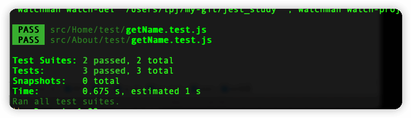
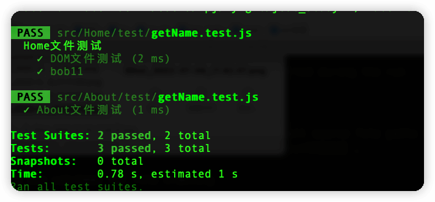

- [jest配置](#jest配置)
  - [verbose](#verbose)
  - [rootDir和roots](#rootdir和roots)
  - [testMatch](#testmatch)
  - [testEnvironment](#testenvironment)

## jest配置

### verbose

每一个测试用例显示描述，既describe和test方法的一个参数。等同 jest --verbose

- verbose:false


- verbose:true
)

### rootDir和roots

- rootDir: string
  jest测试扫描的根目录，默认package.json所在目录
- roots: string[]
  指定根目录下需要测试的文件

```JavaScript
// example/jest环境搭建/jest.config.js
  rootDir: "./src/Home",
  roots: [
    "test",
  ],
```

只会测试src/Home/test下的文件。不会测试src/Home/test1和src/About/test

### testMatch

指定jest要匹配的文件

### testEnvironment

指定jest测试环境，默认node环境，无法使用 DOM Api。  
如果需要使用 DOM Api，安装 yarn add jest-environment-jsdom --dev。  
